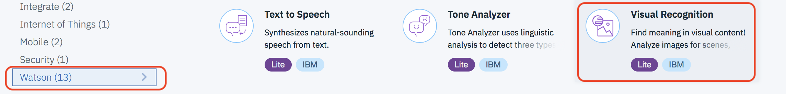
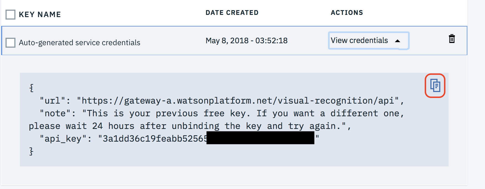
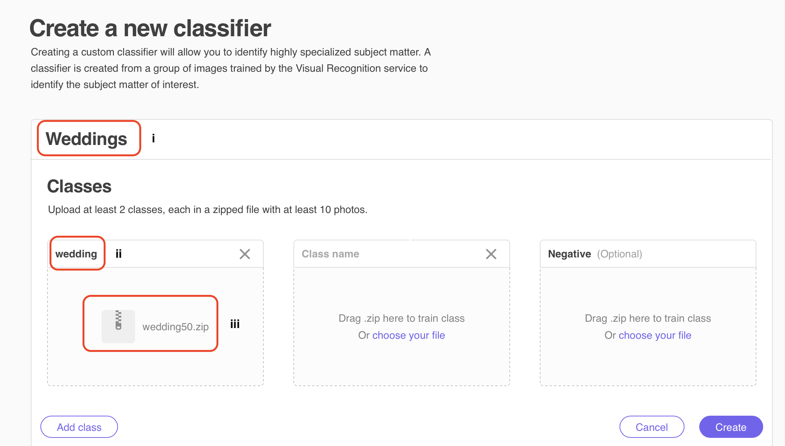
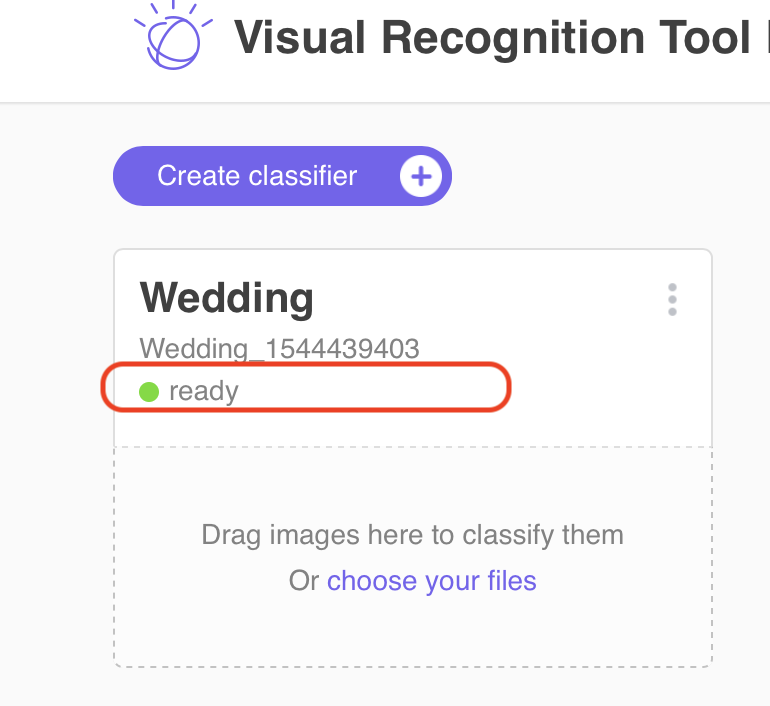
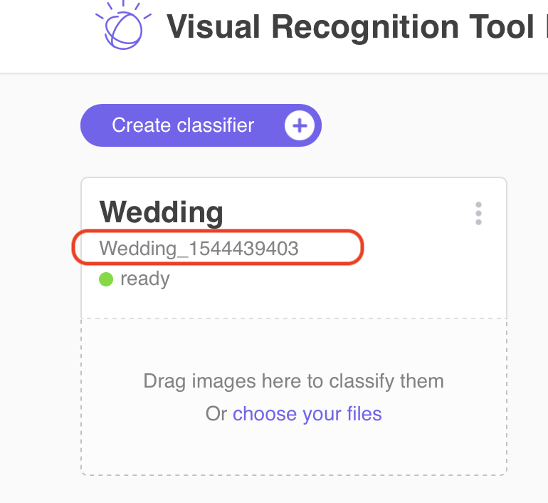
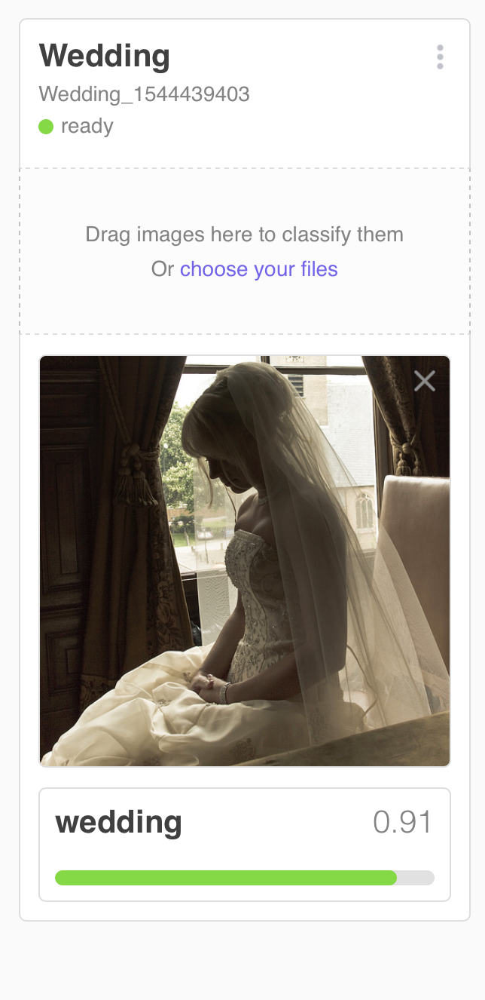
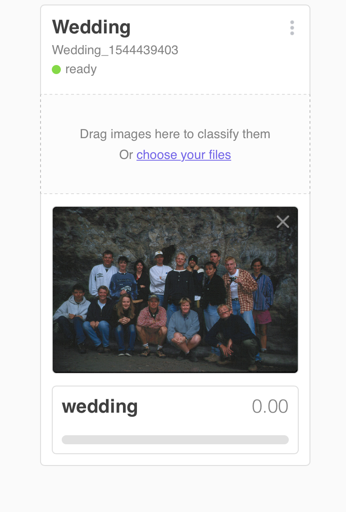

# Create a Watson Visual Recognition custom classifier to detect wedding photos

[The Watson Visual Recognition service](https://www.ibm.com/watson/services/visual-recognition/) can be trained to recognize your own custom classes in images. In this lab you'll learn how to  train a  Watson Visual Recognition custom classifier  to recognition wedding scenes using 50 images of weddings to serve as positive examples  and 50 images that are not weddings to serve as  negative examples.

After creating the custom classifier, you'll test it with different images not used to train it to validate it's accuracy.  

## 1. Setup

### 1.1 Sign up for IBM Cloud

If you are not already signed up for the IBM Cloud, [sign up here](https://console.bluemix.net)

### 1.2 Create an instance of the Watson Visual Recognition Service

1.2.1 From the IBM Cloud Dashboard click on **Create resource**


1.2.2 Select the **Watson** category project type and then click on **Visual Recognition**


1.2.3 Make sure the **Lite plan** is selected and then click **Create**


1.2.4 Select **Service credentials** at the left and then click on **View credentials** next to the credentials generated for your service instance


1.2.5 Click on the icon to copy the credentials to the clipboard and then save them in a text file on your Desktop (or some other convenient location). You'll need the **api_key** value multiple times.


## 2. Create custom classifier

In this section you'll create a custom classifier using 50 images of wedding scenes and 50 images of scenes that are not weddings to serve as negative examples. Training custome classifers can be done using the Watson Visual Recognition REST API but you'll use a web application that wraps those APIs to provide a more user friendly experience

### 2.1 Launch Watson Visual Recognition tool

2.1.1 In a new browser tab launch the tool [http://ibm.biz/vr-tool](http://ibm.biz/vr-tool)

2.1.2 Click on **API Key** and enter the value of the **api_key** that is in your saved service credentials. Click on the arrow icon to continue.


### 2.2 Upload training files and train classifier

2.2.1 Click on **Create classifier**


2.2.2 i) Name the classifier `Weddings` , ii) name the first class `wedding` and then iii) click on **choose your files** to upload the file ***weddings50.zip*** in the ***training_data*** sub folder of this project. iv) Click **Create**


2.2.3 click on **choose your files** in the tile for negative examples to upload the file ***notweddings50.zip*** in the ***training_data*** sub folder of this project.

2.2.4 Delete any unused tiles in the UI  by clicking on the X in the top right of the tile


2.2.5 Click **Create** to create the classifier. After the training files are uploaded the new classifier will appear in the *training* state.


2.2.6 The training will take  about 3-5 minutes. Now is a good time for a coffee break. When the new classifier is trained the state will change to *ready*


2.2.7 Highlight the new classifier's id and copy it to the clipboard. Paste it to the same file you used to save the service's **api_key**. You'll need this later.


## 3 Test custom classifier

Test the classifier with the GUI tool using single images and then test using 60 images via a standalone app. Both Python and Java are provided. Choose the one that you feel most comfortable with.  

Python app requirements

  - [Python 3.5](https://www.python.org/downloads) or later.

Java app requirements:

  - Java 1.7 or later JVM
  - [Gradle Build Tool](https://gradle.org)


### 3.1 Test with GUI tool

3.1.1 Click on  **choose your files** in the tile for your new classifier. Select a file ***0001.jpg***  from the ***test_data/wedding*** sub folder of this project. Verify that the file is classified as a wedding with a high confidence level ( approx 90%).


3.1.2 Click on  **choose your files** in the tile for your new classifier. Select a file ***0001.jpg***  from the ***test_data/notwedding*** sub folder of this project. Verify that the file is not classified as a wedding (confidence level 0)


### 3.2 Test with a Python app

3.2.1 Edit the file ***settings.py*** in the ***test_apps/python*** sub folder of this project. Put in the values of your **api_key** and **clasifier_id** that you save earlier

3.2.2 In a command prompt or terminal navigate to the ***test_apps/python*** sub folder of this project. Run the following command to install the dependencies

`pip -r requirements.txt`

3.2.3 Run the following command to run the tester application

`python watsonvr-wedding-tester.py`

3.2.4 Verify the app runs without errors and the output looks like the following.

```
Classifying 60 test images ...
Finished classifying  10 images
Finished classifying  20 images
Finished classifying  30 images
Finished classifying  40 images
Finished classifying  50 images
Finished classifying  60 images
Number of files 60
True positives 28
True negatives 30
False positives 0
False negatives 2
Accuracy  96.67%
False negative list
test_data/wedding/0029.jpg
test_data/wedding/0023.jpg
```

3.2.5 Look at the files that were reported as false positives or false negatives and see if you can see why the classifier had problems with these particular images.

### 3.3 Test with a Java app

3.3.1 Edit the file ***settings.properties*** in the ***watson-vr-java-tester/src/main/resources*** sub folder of this project. Put in the values of your **api_key** and **classifier_id** that you saved earlier

3.3.2 In a command prompt or terminal navigate to the ***watson-vr-java-tester*** sub folder of this project. Run the following command to build the app

**Linux/Mac**

`./gradlew build`

**Windows**

`gradle.bat build`

3.3.3 Run the following command to run the tester application

**Linux/Mac**

`./gradlew run`

**Windows**

`gradlew.bat run`

3.3.4 (Optional) Run the following command to generate Eclipse artifacts so the project can be imported into Eclipse 

**Linux/Mac**

`./gradlew eclipse`

**Windows**

`gradlew.bat eclipse`

Note: after running the command import this folder as an existing project into Eclipse

3.3.5 Verify the app runs without errors and the output looks like the following.

```
Finished classifying 60 images
Number of files 60
True positives 28
True negatives 30
False positives 0
False negatives 2
Accuracy 96.67
False negative list
/Users/carew@us.ibm.com/build/watsonvr-wedding/test_data/wedding/0029.jpg
/Users/carew@us.ibm.com/build/watsonvr-wedding/test_data/wedding/0023.jpg

BUILD SUCCESSFUL in 55s
3 actionable tasks: 1 executed, 2 up-to-date
```

3.3.6 Look at the files that were reported as false positives or false negatives and see if you can see why the classifier had problems with these particular images.

## Conclusion
Congratulations ! You successfully created a classifier to detect wedding pictures. With just 50 examples and 50 negative examples your were able to quickly created a classifier that is approximately  97% accurate on some randomly selected  test examples. 
